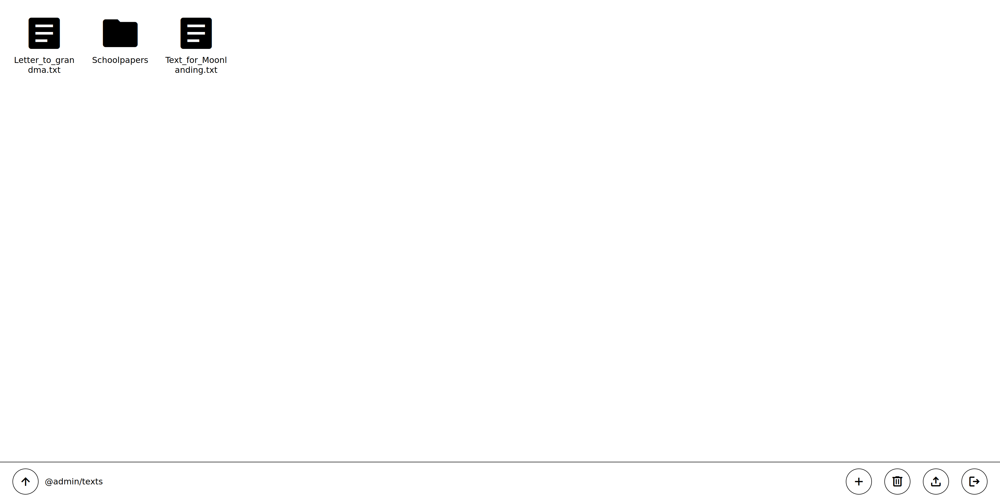
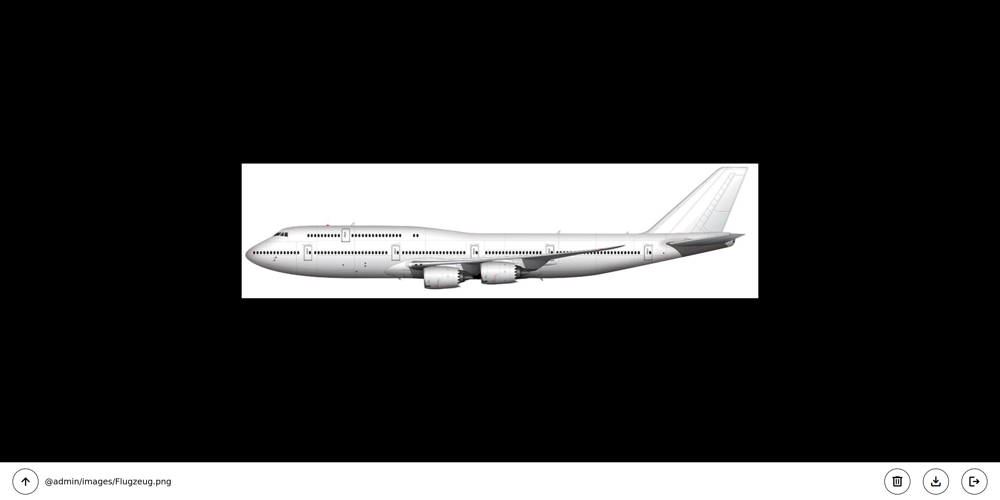
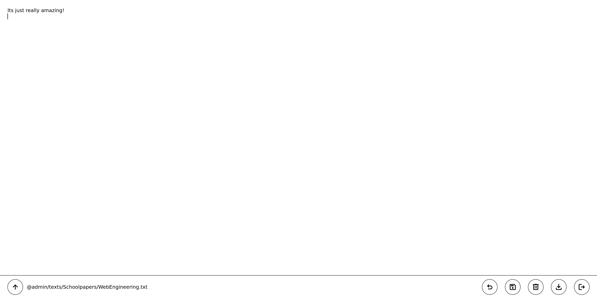
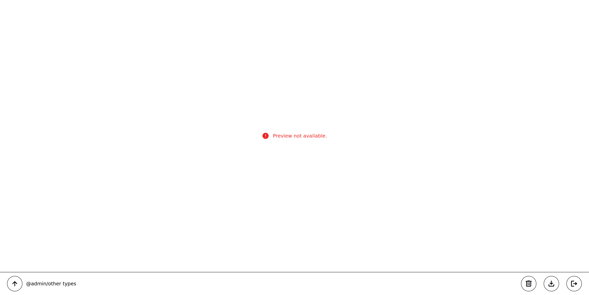
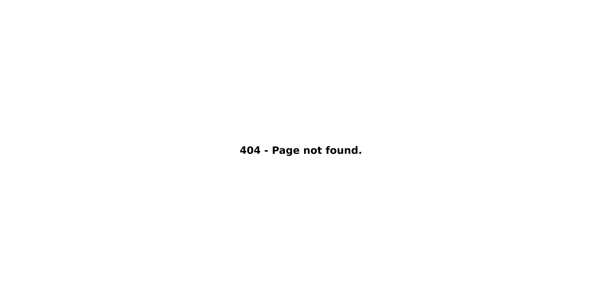

# Web Engineering Project 2023

Project implementation for the class "Web Engineering 1" held by Spörl. Neither the frontend nor the backend, 
especially, is intended for deployment in a production environment.

As required, the frontend does not use any framework or library. Instead, it leverages native 
[web components](https://www.webcomponents.org/).


## Installation

Start the backend service via

```bash
docker run -p 8080:8080 ghcr.io/hfxbse/web-engineering-2023-fileservice:latest
```

and the frontend server via

```bash
docker run -p <any port you like>:80 ghcr.io/hfxbse/web-engineering-2023-fileservice:latest
```

The website should now be reachable via
[http://localhost:\<your chosen port\>](http://localhost:<your%20chosen%20port>).

As an alternative, you can build the Docker image for each service locally from the provided Docker 
files. If you choose to do so, I assume you know how to do that.


## Browser compatibility list

| Browser       | Version              |
|---------------|----------------------| 
| Firefox       | 114.0.2 Linux        | 
| Google Chrome | 114.0.5735.133 Linux |

The content of the website scales down to about 600 pixels in width without issue.

## Usage

The website provides a frontend for a file-storage service. The UI resamples elements commonly found on 
websites. A blue tone is used as a highlight color and red to indicate errors. Other elements are kept black.


### Authentication

To log in, you first enter your username and then your password. Then you click on the blue
button labeled "Login". If your credentials are incorrect, or you could not log in for any other reason, an error 
message is shown below the form, as shown in the picture.


After successfully logging into the website, you will be redirected to the path you tried to visit before
getting redirected to the login page.


### Control panel

At the bottom of every page, aside from the authentication page and the "page not found"-page, is a control panel.
It will show the location  you are currently at, prefixed by the username you logged in as. To go up the location path,
press the arrow button to the left of it. If you are already at the content root, a home button will be shown instead. 
In addition, the native browser navigation can be used.


The button on the far right side allows you to log out at any point. To the left of it, additional buttons will be
shown depending on the content type at your current location. The actions those buttons represent always apply to your
current location.


#### Control panel buttons

| Button                                         | Action description                                                                           | Display conditions                                      |
|------------------------------------------------|----------------------------------------------------------------------------------------------|---------------------------------------------------------|
|      | Logs the user you signed in as out.                                                          | A user is logged in.                                    |
|    | Opens the entry creation dialog.                                                             | The content is a directory.                             |
|      | Deletes the content at the current path. Only empty directories can be deleted successfully. | The entry exists and is not the content root.           |
|  | Saves the file at the current location to disk.                                              | The entry exists and is not a directory.                |
|      | Reverts the text file to the last saved state.                                               | The content is a text file to which changes were made. |
|          | Saves the changes made to the text file on the server.                                       | The content is a text file to which changes were made. |
|      | Uploads a file you select through your system's native file picker to the server.             | The content is a directory.                             |


### Directories

If the content at your current location represents a directory, its content will be shown in a grid. Each entry
has a type represented by an icon. Below the icon, the name of the corresponding entry is shown.



#### Entry-type icons

| Icon                                                        | Type      | Navigation target                      |
|-------------------------------------------------------------|-----------|----------------------------------------|
|        | Directory | Location represented by the directory. |
|                | Audio     | Media view for the matching audio.     |
|                | Image     | Media view for the matching image.     |
|                  | Text      | Text editor for the matching text.     |
|                | Video     | Media view for the matching video.     |
|  | Unknown   | Download page for the matching file.   |


### Media view

Allows you to look at images, watch videos, or listen to audio right in the browser. The true size of the media is 
used, but no more than the maximal available height and height, preserving the aspect ratio. It gets centered on a 
black background, to reduce distraction from it.




### Text editor

Displays the content of a text file in your browser. To edit it, click on the position in the text you want to modify 
and start typing. After you are done editing, you can either save your changes or revert to the last saved state of 
the text file.




### Other file types

For a file that is not text, audio, video, or image, no preview is displayed, but it can still be downloaded or deleted.




### Accessing a non-existing file

If no file or directory entry exists for the current location, an error message is displayed in the middle of the page.
It differs from trying to access a page of the website that does not exist by still displaying the control panel at the
bottom of the page.


### Accessing a page that is not part of the website

In case you try to access a page that is not part of the website, a simple "404 - Page not found."-page is shown.




### Error dialog

If an action without a dialog, like the delete action or file upload, fails, an error dialog is displayed for it.
It can be closed by either clicking on the button labeled "Ok" or by pressing "Esc" on your keyboard.


### Creation dialog

To create a new text file or directory, open the creation dialog. There, you enter the name of the entry you are trying
to create. After that, you can choose to create a directory or a text file by selecting it. Finally, you click on the 
blue button labeled "Save". If you decide not to create a new entry, you can exit the dialog by clicking on the button
labeled "Cancel" or by pressing "Esc" on your keyboard.

If an error occurs, you will be informed below the dialog. An entry name cannot be  a singular dot ("."), two dots 
("..") or contain slashes ("/").


